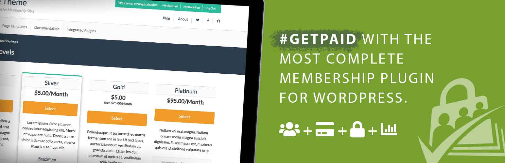

# [Paid Memberships Pro](https://www.paidmembershipspro.com) #
[comment]: # (Generate badges from shields.io, only works for .org plugins to get other stats etc. We'd have to create our own endpoints for Premium plugins)

  

### Welcome to the Paid Memberships Pro GitHub Repository

Paid Memberships Pro gives you all the tools you need to start, manage, and grow your membership site. The plugin is designed for premium content sites, clubs/associations, subscription products, newsletters, and more.

Users can select a membership level, complete checkout, and immediately become members of your site. You decide what content your member can access. Members can log in, view payments, update billing info, or cancel their account directly on your site. [View Screenshots »](https://www.paidmembershipspro.com/features/screenshots/)

For more information please visit [the Paid Memberships Pro website](https://www.paidmembershipspro.com)

## Paid Memberships Pro is Open Source Software 

Paid Memberships Pro is distributed under the GPLv2 license. This means, among other things, that you may use the software on any site free of charge.

An annual support license is recommended for websites running Paid Memberships Pro. This support license includes access to our technical support team in the Member Support Area, as well as one-click installation and updates for over 70 feature-enhancing Add Ons. Plus membership is backed by a 30-day, no questions asked, refund guarantee.

[Purchase a Plus Membership »](https://www.paidmembershipspro.com/membership-checkout/?level=20)

## Installation ##
For detailed installation steps, visit the [documentation on installing the plugin](https://www.paidmembershipspro.com/documentation/download/) and the [initial plugin setup instructions](https://www.paidmembershipspro.com/documentation/initial-plugin-setup/).

1. Download the current development ZIP file directly: `https://github.com/strangerstudios/paid-memberships-pro/archive/dev.zip`

**Please ensure that once installing this version of the plugin to remove `-dev` from the plugin's folder name.**

## Bugs ##
If you find an issue/bug, let us know by [creating a detailed GitHub issue](https://github.com/strangerstudios/paid-memberships-pro/issues/new/choose).

## Support ##
This is a developer's portal for Paid Memberships Pro. We do not offer support on this channel. **Any support related questions should be directed to [paidmembershipspro.com](https://www.paidmembershipspro.com).**

## Contributing to Paid Memberships Pro ##
We encourage and welcome any contribution to Paid Memberships Pro. Please read the [guidelines for contributing](https://github.com/strangerstudios/paid-memberships-pro/blob/dev/.github/CONTRIBUTING.md) to this repository.

There are various **ways to help the development** of Paid Memberships Pro:

1. Report [bugs/issues](https://github.com/strangerstudios/paid-memberships-pro/issues/new/choose) on GitHub.
2. Work on any issues by submitting a Pull Request.

Here are some ways for **non-developers to contribute** to Paid Memberships Pro:

1. Translate Paid Memberships Pro into your own [language](https://www.paidmembershipspro.com/paid-memberships-pro-in-your-language/).
2. [Purchase a plus membership](https://paidmembershipspro.com/pricing) to help fund ongoing development and bug fixes.
3. Leave an honest review for [Paid Memberships Pro](https://wordpress.org/support/plugin/paid-memberships-pro/reviews/#new-post).